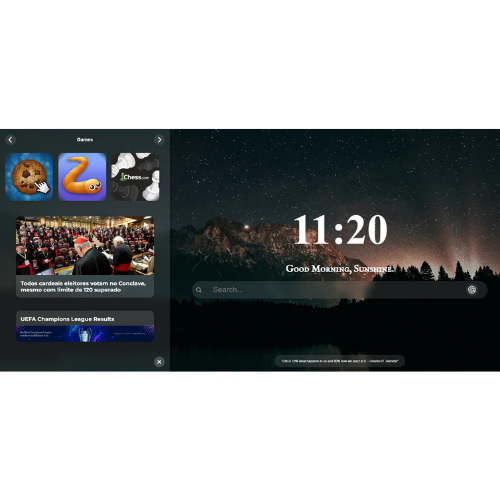

# Velum Browser Extension

Velum is a versatile browser extension available for Chrome, Edge, Firefox, and Opera browsers. It enhances your browsing experience with a customizable background, clean dashboard, news integration, and various useful features.

    

## Features

- **Customizable Features**: Personalize your browser's new tab page with "Load Image" feature that allows YOU to choose your own style
- **News Integration**: Stay updated with the latest news directly from your browser
- **Chat GPT**: Shortcut to your favorite AI :) 
- **Game Integrations**: Quick access to popular games like:
  - Cookie Clicker
  - Chess
  - Diep.io
  - Slither.io
  
  

- **UCL Widget**: Special integration with UCL-results (my last project)
- **Cross-Browser Support**: Available for:
  - Google Chrome
  - Microsoft Edge
  - Mozilla Firefox
  - Opera
    
.gif)

## Installation

### Chrome
1. Download the extension from the Chrome Web Store (coming soon)
2. Or load it as an unpacked extension:
   - Go to `chrome://extensions/`
   - Enable "Developer mode"
   - Click "Load unpacked"
   - Select the `chrome` folder from this repository

### Edge
1. Download the extension from the Microsoft Edge Add-ons store (coming soon)
2. Or load it as an unpacked extension:
   - Go to `edge://extensions/`
   - Enable "Developer mode"
   - Click "Load unpacked"
   - Select the `edge` folder from this repository

### Firefox
1. Download the extension from the Firefox Add-ons store (coming soon)
2. Or load it temporarily:
   - Go to `about:debugging`
   - Click "This Firefox"
   - Click "Load Temporary Add-on"
   - Select the `firefox` folder from this repository

### Opera
1. Download the extension from the Opera Add-ons store (coming soon)
2. Or load it as an unpacked extension:
   - Go to `opera://extensions`
   - Enable "Developer mode"
   - Click "Load unpacked"
   - Select the `opera` folder from this repository

## Development

To contribute to the project:

1. Clone this repository
2. Install dependencies (if any)
3. Make your changes
4. Test the extension in your preferred browser
5. Submit a pull request

## Support

For support, feature requests, or bug reports, please open an issue in this repository.

## Final Regards

This project was an incredible learning journey. I dove deep into JavaScript, which was challenging at times but ultimately rewarding — especially when making the interactive dashboard work smoothly.
Styling with CSS became my favorite part of the process: I discovered glassmorphism and hover effects, and honestly, I can't live without them anymore. They brought the aesthetic I had in mind to life, making the interface feel modern and elegant.
Building Velum also taught me a lot about browser extension development, cross-browser compatibility, and how to create something both useful and beautiful from scratch

 
